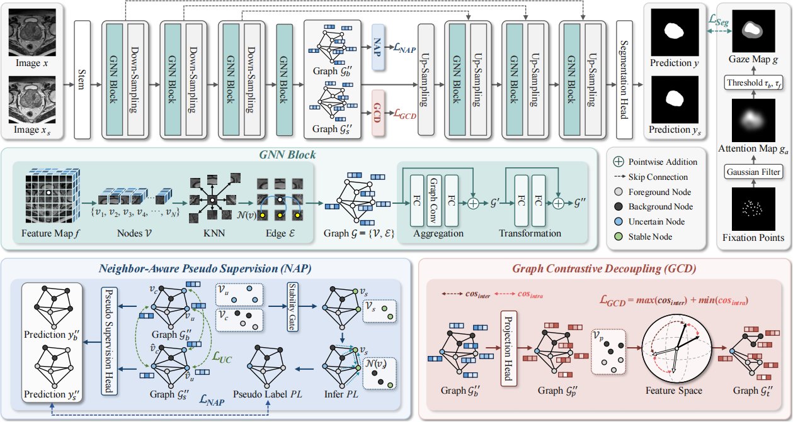
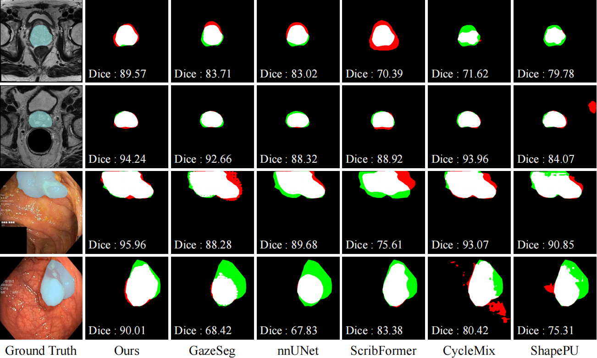

# Graph-based Neighbor-Aware Network for Gaze-Supervised Medical Image Segmentation

This project contains the training and testing code for the paper, as well as the model weights trained according to our method.

## Method


## Model Weights
The performance of our method is expressed as the mean and standard deviation of three different seed runs.
| |  NCI-ISBI |  KvasirSEG |
| :-: | :-: | :-: |
| Ours | 80.33 $\pm$ 0.24 | 79.32 $\pm$ 0.39 |
|Highest Dice| 80.53| 79.69|

The download links for our model weights are as [Weights](https://pan.baidu.com/s/1hiUfYfmO3XsEAawPg6Kazg?pwd=6be3).

## Datasets
The gaze of GazeMedSeg dataset can be downloaded at [Gaze](https://drive.google.com/drive/folders/1-38bG_81OsGVCb_trI00GSqfB_shCUQG).\
The GazeMedSeg dataset can download at [GazeMedSeg](https://drive.google.com/drive/folders/1XjgQ27R8zT8ymOTXohgl8HXntPEUbIXj).

The Kvasir dataset can download at [Kvasir](https://datasets.simula.no/kvasir-seg/).\
The NCI-ISBI dataset can download at [NCI](https://www.cancerimagingarchive.net/analysis-result/isbi-mr-prostate-2013/).

## Results


## Requirements
```
python == 3.8
torch == 1.12.0
numpy == 1.24.4
medpy == 0.5.1
nibabel == 5.2.1
pandas == 2.0.3
scikit-image == 0.21.0
```
